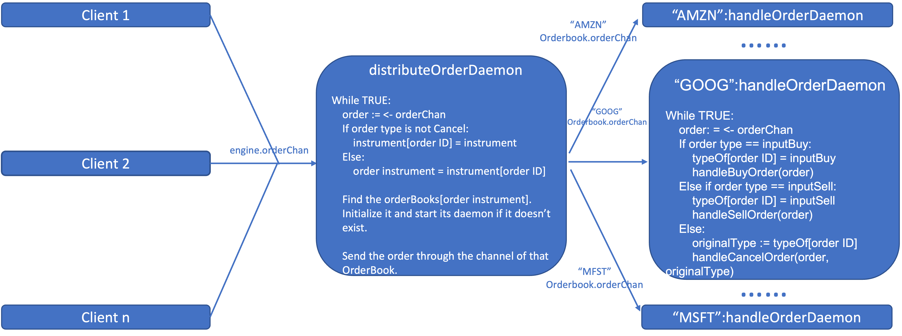

# Matching Machine in Go

## Data Structure:

> `Order`: Wrap around `input`
```go
type Order struct {
	detail         input
	completionTime int64 // input timestamp
	index          int	// for heap to use
	executed       bool	// to check the order can be cancelled or not
}
```

> `BuyHeap`: A heap containing buy order
```go
func (h BuyHeap) Less(i, j int) bool {
	if h[i].detail.price == h[j].detail.price {
		return h[i].completionTime < h[j].completionTime
	}
	return h[i].detail.price > h[j].detail.price
}
```

> `SellHeap`: A heap containing sell order
```go
func (h SellHeap) Less(i, j int) bool {
	if h[i].detail.price == h[j].detail.price {
		return h[i].completionTime < h[j].completionTime
	}
	return h[i].detail.price < h[j].detail.price
}
```

> `OrderBook`: All orders and other infomation of given `instrument`
```go
type OrderBook struct {
	buy       BuyHeap
	sell      SellHeap
	typeOf    map[uint32]inputType
	orderChan chan Order
}
```

> `Engine`: Engine
```go
type Engine struct {
	orderBooks map[string]*OrderBook
	instrument map[uint32]string
	orderChan  chan Order
}
```

## Basic Logic

### Buy and Sell Order

1. Getting an input from client, warp an `Order`.
2. Send the `Order` through `e.orderChan`, where `e` is an global instance of `Engine`.
3. `Engine::distributeOrderDaemon()`  recieves the `Order`, and distributes the order to `OrderBook` using its `instrument`. Meanwhile record the `orderId`-`instrument` mapping (for cancel order).
4. `OrderBook` first tries to match the arriving `Order` in heap of opposite `inputType`, if one order is matched, set `Order.executed = true`. Add to inputType`Heap` if there is remnant. Meanwhile record the `orderId`-`inputType` mapping (for cancel order).

### Cancel Order

1. Getting an input from client, warp an `Order`.
2. Send the `Order` through `e.orderChan`, where `e` is an global instance of `Engine`.
3. `Engine::distributeOrderDaemon()`  recieves the `Order`, and distributes the order to `OrderBook` using `orderId`-`instrument` mapping.
4. Search the order in correspondingType`Heap` using `orderId`-`inputType` mapping. Accept and delete the `Order` (and fixed heap) if `Order.executed` is not set.
   
## Concurrency
> The concurrency is done by the concurrency of gorountines (daemons).
> 
### Channels and Gorountines

#### Channels
> Channels are used to pass order between two data structures using fan-in and fan-out pattern.

#### Goroutines
> Goroutines are used as daemons in this program. 
> 
> Basically, one daemon for each `engine` (i.e only one engine daemon in this program), and one daemon for each `OrderBook`. 
> 
> Usually they are started when calling `newXXXX` (XXXX is `engine` or `OrderBook`) method. 
> 
> Considering there might not be so much `instrument`, I didn't recycle those daemons, which means they can only be destroyed after program exits.

#### General structure of the usage of channles and gorountines

>Daemons and processes are represented as blue block, and function calls are represented as text.


